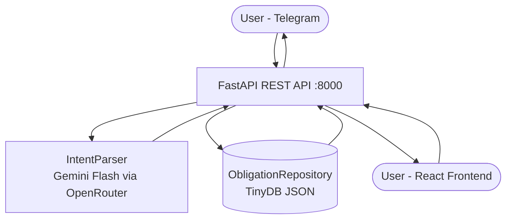

<div align="center">

# Memory Logger

Personal finance tracker powered by NLP — track debts conversationally via Telegram or a web dashboard.


</div>

---

## Features

| Conversational Tracking | Multi-Person Splits | Web Dashboard |
|---|---|---|
| NLP intent parsing for add, settle, query, edit, and delete via natural language | Auto-divides group expenses by headcount; one entry per person linked by `trxn_id` | React SPA with search, sort, filter by direction, and live stats |

- **7 recognized intents** — `add`, `settle`, `query`, `edit`, `delete`, `chitchat`, `off_topic`
- **Recurring obligations** — monthly deductions tracked automatically (e.g. salary advances)
- **Disambiguation keyboard** — when a person has multiple active obligations, an inline picker lets you choose the right one
- **Conversation history** — last 10 messages are passed to the LLM so multi-turn references resolve naturally (*"yes, 500"*)
- **Confirmation flow** — mutating actions show an inline Yes/No keyboard before executing

---

## Architecture



---

## Repo Structure

```
memory-logger/
├── backend/                    ← FastAPI server + Telegram bot
│   ├── main.py
│   ├── app/
│   │   ├── api/routes.py
│   │   ├── bot/handler.py
│   │   ├── db/repository.py
│   │   ├── llm/parser.py
│   │   └── models/schemas.py
│   ├── tests/
│   ├── pyproject.toml
│   └── .env.example
├── frontend/                   ← React 19 + Vite + Tailwind SPA
│   ├── src/
│   ├── public/
│   ├── index.html
│   └── vite.config.js
├── .gitignore
└── README.md
```

---

## Quick Start

### Prerequisites

- Python 3.10+
- Node.js 18+
- [OpenRouter API key](https://openrouter.ai)
- [Telegram bot token](https://t.me/BotFather)

### Backend

```bash
# 1. Clone and enter the backend directory
git clone https://github.com/your-username/memory-logger.git
cd memory-logger/backend

# 2. Create and activate a virtual environment
python -m venv .venv
source .venv/bin/activate

# 3. Install dependencies
pip install -e .

# 4. Create your .env file
cat <<EOF > .env
OPENROUTER_API_KEY=your_openrouter_key
TELEGRAM_BOT_TOKEN=your_telegram_bot_token
DB_PATH=memory_ledger.json
LLM_MODEL=google/gemini-2.0-flash-exp
EOF

# 5. Start the server (FastAPI on :8000 + Telegram bot polling)
python main.py
```

### Frontend

```bash
# 1. Enter the frontend directory and install dependencies
cd memory-logger/frontend
npm install

# 2. Start the dev server
npm run dev
```

> **Note:** The dev server runs on `http://localhost:5173` and proxies `/obligations` and `/parse` requests to the backend at `http://localhost:8000`.

---

## Telegram Bot Usage

### Commands

| Command | Description |
|---|---|
| `/start` | Welcome message with usage examples |
| `/help` | Same as `/start` |
| `/create` | Start a guided session to add a new obligation |
| `/pending` | Show all active obligations with subtotals |
| `/settled` | Show all settled obligations |

<details>
<summary><strong>Adding obligations</strong></summary>

Use `/create` to start a session, then describe the transaction in plain language. The bot parses your message, shows a structured field-by-field summary for review, and saves on confirmation.

```
You:  /create
Bot:  Let's create a new obligation. Describe the transaction...

You:  Gave Sunita 5k advance, deduct 1k monthly
Bot:  Sunita's advance: Total ₹5,000, monthly deduction ₹1,000 (~5 months).
      Should I add this?

      Person: Sunita
      Amount: ₹5,000
      Direction: They owe you
      Type: Recurring
      Monthly deduction: ₹1,000
      Note: Advance

      [Yes ✓] [No ✗]
```

If something looks wrong, type a correction instead of tapping Yes — the bot re-parses with the updated info:

```
You:  Make it 8k
Bot:  (updated summary with Amount: ₹8,000)
      [Yes ✓] [No ✗]
```

**More examples:**

```
# One-time debt — someone owes you
/create → "Rahul owes me 2500 for concert tickets"

# One-time debt — you owe someone
/create → "I owe Priya 1800 for groceries"

# Splitting a group expense (divides by headcount: 3 people)
/create → "Dinner with Rahul and Priya, total 3200, I paid"

# Recurring obligation
/create → "Gave Sunita 5000 advance, deduct 1000 per month"
```

</details>

<details>
<summary><strong>Recording payments & settlements</strong></summary>

Settlements, queries, and payments work from normal chat — no `/create` needed.

```
# Record a partial payment
"Rahul paid 500"
→ Deducts ₹500 from Rahul's remaining balance

# Settle in full
"Sunita settled up"
→ Marks the obligation fully settled (remaining drops to zero)

# Check balances
"What does Rahul owe?"
"What's pending?"
```

</details>

<details>
<summary><strong>Editing & deleting</strong></summary>

```
# Edit an existing obligation
"Change Rahul's amount to 3000"

# Delete an obligation
"Delete Priya's obligation"
```

When a person has multiple active obligations, the bot shows a picker:

```
Rahul has 2 active obligations. Which one?

[₹1,067 (one_time) — Dinner]
[₹5,000 (recurring) — Phone advance]
[Cancel]
```

</details>

### Tips

- You only need `/create` for **adding** new obligations. Everything else works from normal chat.
- The bot remembers the last 10 messages, so you can answer follow-ups naturally.
- When a person has multiple active obligations, a picker lets you choose the right one.

---

## API Reference

All endpoints are served at `http://localhost:8000`.

| Method | Path | Description |
|---|---|---|
| `POST` | `/parse` | Parse a natural-language message into a structured `LLMResponse` |
| `POST` | `/obligations` | Create a new obligation |
| `GET` | `/obligations` | List obligations (optional `?status=active\|settled`) |
| `GET` | `/obligations/{id}` | Get a single obligation by ID |
| `PATCH` | `/obligations/{id}` | Update obligation fields (partial) |
| `DELETE` | `/obligations/{id}` | Delete an obligation |
| `POST` | `/obligations/{id}/transactions` | Record a payment against an obligation |
| `POST` | `/obligations/{id}/settle` | Settle an obligation (remaining → 0) |

---

## Data Models

The core entity is an **Obligation** — a record of money owed between you and another person. Each obligation carries a full payment history as a list of **Transactions**.

### Obligation

```
id                 int | None          Auto-assigned DB doc ID
trxn_id            str | None          UUID grouping multi-person splits
person_name        str                 Name of the other party
type               "recurring" | "one_time"
direction          "owes_me" | "i_owe"
total_amount       float               Original/total amount
expected_per_cycle float | None        Monthly amount (recurring only)
remaining_amount   float               How much is still owed
status             "active" | "settled"
created_at         datetime            Auto-set on creation
note               str | None          Free-text description
transactions       list[Transaction]   Payment history
```

### Transaction

```
amount             float               Payment amount
paid_at            datetime            When the payment occurred
note               str | None          Optional note
```

### ParsedIntent

```
action             "add" | "settle" | "query" | "edit" | "delete" | "chitchat" | "off_topic"
persons            list[str]           People involved
amount             float | None        Amount in INR
direction          "owes_me" | "i_owe"
obligation_type    "recurring" | "one_time" | None
expected_per_cycle float | None
note               str | None
is_ambiguous       bool                Whether clarification is needed
clarifying_question str | None         Question to ask if ambiguous
```

### LLMResponse

```
parsed               ParsedIntent | None   Structured intent (None on parse failure)
confirmation_message str                   Human-readable summary
requires_confirmation bool                 Whether to show Yes/No buttons
```

---

## How the Bot + LLM Pipeline Works

<details>
<summary><strong>Expand pipeline walkthrough</strong></summary>

### Step 1: User Sends a Message

A text message (or voice note) arrives in `handler.py:handle_message`. The handler clears any stale inline-keyboard state from a previous turn and sends a typing indicator.

### Step 2: LLM Intent Parsing

`IntentParser.parse()` in `parser.py` constructs a message array and sends it to OpenRouter (Gemini Flash) at **temperature 0.1**:

| # | Role | Content |
|---|---|---|
| 1 | `system` | The full system prompt from `prompts.py` (~260 lines of rules covering action types, amount parsing, split math, direction rules, recurring vs one-time, ambiguity handling, and worked examples). |
| 2 | `user` | **Active obligations context** — a formatted dump of every active obligation so the LLM knows the current ledger state. |
| 3 | `user`/`assistant` (alternating) | **Last 10 conversation messages** — enables multi-turn resolution. |
| 4 | `user` | The current user message. |

The LLM responds with JSON, validated into an `LLMResponse` containing a `ParsedIntent`, a `confirmation_message`, and a `requires_confirmation` flag.

### Step 3: Intent Routing

Based on `parsed.action`, the handler branches:

- **`chitchat` / `off_topic`** — Reply with the LLM's friendly message. No database action. Conversation history is cleared.
- **`query`** — Look up obligations via `repo.get_by_person()` or `repo.get_all()`, format a summary, and reply. No confirmation needed.
- **`is_ambiguous = true`** — Store the exchange in conversation history, relay the clarifying question, and wait for the follow-up.
- **`add` / `settle` / `edit` / `delete`** — Proceed to the confirmation step.

### Step 4: User Confirmation

For mutating actions, the bot sends the `confirmation_message` with inline **Yes / No** buttons. The pending `ParsedIntent` is stored in `context.user_data["pending_action"]`. When the user taps a button, `handle_confirmation` fires.

### Step 5: Action Execution

- **Yes** — Dispatches to the appropriate executor:
  - `_execute_add` — Creates one or more obligations. For multi-person splits, generates a shared `trxn_id` and creates one obligation per person with the per-person amount.
  - `_execute_settle` — Records a partial payment (with amount) or marks the obligation fully settled.
  - `_execute_edit` — Calls `repo.update()` with only the changed fields.
  - `_execute_delete` — Calls `repo.delete()` to remove the record.
- **No** — Clears `pending_action`, replies "Cancelled".

### Step 6: Disambiguation

When a settle, edit, or delete targets a person with **multiple active obligations**, the bot presents an inline keyboard listing each one. The user picks one, and `_handle_choice()` executes on that specific record.

### Pipeline Diagram

```
User (Telegram)
    │
    ▼
handle_message()
    │
    ├─ Clears stale keyboard state
    ├─ Sends typing indicator
    │
    ▼
IntentParser.parse(message, obligations_context, history)
    │
    ▼
LLM returns LLMResponse { parsed, confirmation_message, requires_confirmation }
    │
    ├─ AMBIGUOUS ──────► Store in history, send clarifying question, wait
    ├─ CHITCHAT/OFF_TOPIC ► Reply, clear history
    ├─ QUERY ──────────► Fetch from DB, format, reply
    └─ ADD/SETTLE/EDIT/DELETE
           │
           ▼
       Show Yes / No inline keyboard
       Store pending_action
           │
           ▼
       handle_confirmation()
           │
           ├─ No  ► Clear state, reply "Cancelled"
           └─ Yes
               │
               ├─ Multiple matches? ► Show disambiguation keyboard
               │       │
               │       ▼
               │   _handle_choice() ► Execute on selected obligation
               │
               └─ Single match ► Execute directly
                       │
                       ▼
                   _execute_add / _execute_settle / _execute_edit / _execute_delete
                       │
                       ▼
                   repo.add / repo.settle / repo.update / repo.delete
                       │
                       ▼
                   TinyDB (memory_ledger.json)
```

</details>

---

## Frontend Features

The React SPA is an independent entry point into the same data store as the Telegram bot, with live polling every 5 seconds.

- **Stats bar** — Owed to you / You owe / Net balance, calculated from remaining amounts across all active obligations
- **Tabs** — Active (filterable by direction) and Settled (read-only)
- **Search, filter, sort** — Filter by person name; sort by newest, highest amount, or alphabetical
- **ObligationCard** — Amount, type badge, direction indicator (green = owes me, orange = I owe), transaction history, and an overflow menu for Settle / Edit / Delete
- **GroupedObligationCard** — Obligations sharing a `trxn_id` are collapsed into one expandable card showing group total, headcount, and avatar initials; expands to per-person rows
- **AddObligationForm** — Modal with multi-person chip input, auto-split, direction toggle, type toggle, and optional monthly deduction field for recurring obligations

---

## Tech Stack

| Layer | Technology |
|---|---|
| Runtime | [Python 3.10+](https://www.python.org/) |
| API Framework | [FastAPI](https://fastapi.tiangolo.com/) + [Uvicorn](https://www.uvicorn.org/) |
| Database | [TinyDB](https://tinydb.readthedocs.io/) (JSON document store) |
| Data Validation | [Pydantic](https://docs.pydantic.dev/) + Pydantic Settings |
| LLM | [Gemini Flash](https://openrouter.ai/google/gemini-2.0-flash-exp) via [OpenRouter](https://openrouter.ai/) (OpenAI-compatible SDK) |
| Bot | [python-telegram-bot](https://python-telegram-bot.org/) |
| Frontend | [React 19](https://react.dev/) |
| Build Tool | [Vite 7](https://vitejs.dev/) |
| Styling | [Tailwind CSS 4](https://tailwindcss.com/) |
| Logging | [Loguru](https://loguru.readthedocs.io/) |
