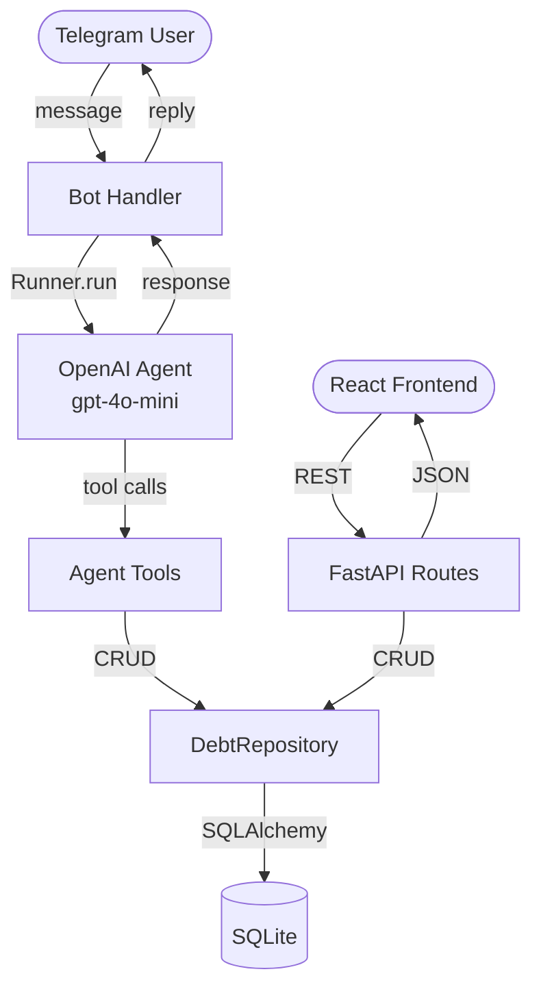

<div align="center">

# Memory Logger

Track debts conversationally via Telegram or a web dashboard — powered by an AI agent.


</div>

---

## Architecture


```mermaid
graph TD
    TG([Telegram User]) -->|message| BH[Bot Handler]
    BH -->|Runner.run| AG[OpenAI Agent<br/>gpt-4o-mini]
    AG -->|tool calls| TOOLS[Agent Tools]
    TOOLS -->|CRUD| REPO[DebtRepository]
    REPO -->|SQLAlchemy| DB[(SQLite)]

    FE([React Frontend]) -->|REST| API[FastAPI Routes]
    API -->|CRUD| REPO

    AG -->|response| BH
    BH -->|reply| TG
    API -->|JSON| FE
```

The **OpenAI Agent** is the brain. It receives natural language, decides which tools to call, handles disambiguation and clarification, and returns a human-friendly response. The **REST API** serves the React frontend directly (no agent involved).

---

## Project Structure

```
memory-logger/
├── backend/
│   ├── main.py                → FastAPI app + Telegram bot startup
│   ├── app/
│   │   ├── agent.py           → Agent definition + system prompt
│   │   ├── tools.py           → 7 @function_tool functions
│   │   ├── api/routes.py      → REST endpoints for frontend
│   │   ├── bot/handler.py     → Thin Telegram adapter (~30 lines)
│   │   ├── db/
│   │   │   ├── database.py    → SQLAlchemy engine + session
│   │   │   ├── models.py      → Debt and Transaction ORM models
│   │   │   └── repository.py  → CRUD operations
│   │   ├── models/schemas.py  → Pydantic request/response schemas
│   │   └── config.py          → Settings from .env
│   └── pyproject.toml
├── frontend/
│   ├── src/
│   │   ├── App.jsx            → Main app (stats, tabs, search, sort)
│   │   ├── api.js             → Fetch wrappers for /debts endpoints
│   │   └── components/        → DebtCard, DebtList, AddDebtForm, etc.
│   └── vite.config.js
└── docs/
    ├── scenarios.md           → Agent behavioral spec (50+ scenarios)
    └── plans/                 → Design and implementation docs
```

---

## Core Components

**Agent** (`agent.py`) — Single OpenAI Agent using `gpt-4o-mini`. System prompt covers Hinglish, currency parsing (`5k` → 5000), split math, disambiguation, and clarification rules.

**Bot Handler** (`bot/handler.py`) — ~30 lines. Receives a Telegram message, passes it to `Runner.run(agent, message, session_id=user_id)`, sends back the response. No state machine, no slash commands.

**Tools** (`tools.py`) — 7 functions the agent can call (see below). Each tool interacts with the DB through `DebtRepository`.

**REST API** (`api/routes.py`) — 7 endpoints serving the React frontend. Direct CRUD, no agent involved.

**Database** (`db/`) — SQLite via SQLAlchemy. Two tables: `debts` and `transactions` (linked by foreign key).

---

## Agent Tools

| Tool | What it does |
|---|---|
| `create_debt` | Create a single debt (one-time or recurring) |
| `create_split_debts` | Create multiple debts for a group expense, split equally by headcount |
| `query_debts` | Search/filter debts by person, status, or direction |
| `edit_debt` | Update a debt's amount, note, person name, or monthly deduction |
| `record_payment` | Record a partial or full payment; auto-settles when remaining hits 0 |
| `settle_debt` | Mark a debt as fully settled |
| `delete_debt` | Permanently remove a debt |

---

## API Endpoints

All served at `http://localhost:8000`.

### `POST /debts`

Create a new debt.

```jsonc
// Request
{ "person_name": "Rahul", "type": "one_time", "direction": "owes_me", "total_amount": 5000, "note": "Groceries" }

// Response — 200
[{ "id": 1, "person_name": "Rahul", "type": "one_time", "direction": "owes_me", "total_amount": 5000, "remaining_amount": 5000, "status": "active", "note": "Groceries", "created_at": "...", "transactions": [] }]
```

### `GET /debts?status=active|settled`

List debts, optionally filtered by status.

```jsonc
// Response — 200
[{ "id": 1, "person_name": "Rahul", ... }, { "id": 2, "person_name": "Priya", ... }]
```

### `GET /debts/{id}`

Get a single debt by ID.

### `PATCH /debts/{id}`

Partial update. Recalculates `remaining_amount` when `total_amount` changes.

```jsonc
// Request (all fields optional)
{ "person_name": "Rahul K", "total_amount": 6000, "note": "Updated" }

// Response — 200
{ "id": 1, "remaining_amount": 4000, ... }
```

### `DELETE /debts/{id}`

```jsonc
// Response — 200
{ "detail": "Debt deleted" }
```

### `POST /debts/{id}/transactions`

Record a payment. Auto-settles if remaining hits 0.

```jsonc
// Request
{ "amount": 2000, "note": "Partial payment" }

// Response — 200
{ "id": 1, "remaining_amount": 3000, "status": "active", "transactions": [{ "amount": 2000, "paid_at": "...", "note": "Partial payment" }], ... }
```

### `POST /debts/{id}/settle`

Mark fully settled. Records a final transaction for the remaining balance.

```jsonc
// Response — 200
{ "id": 1, "remaining_amount": 0, "status": "settled", ... }
```

---

## Tech Stack

| Layer | Technology |
|---|---|
| AI Agent | [OpenAI Agents SDK](https://openai.github.io/openai-agents-python/) + gpt-4o-mini |
| API | [FastAPI](https://fastapi.tiangolo.com/) + [Uvicorn](https://www.uvicorn.org/) |
| Database | [SQLite](https://www.sqlite.org/) via [SQLAlchemy](https://www.sqlalchemy.org/) |
| Bot | [python-telegram-bot](https://python-telegram-bot.org/) |
| Frontend | [React 19](https://react.dev/) + [Vite 7](https://vitejs.dev/) + [Tailwind CSS 4](https://tailwindcss.com/) |
| Logging | [Loguru](https://loguru.readthedocs.io/) |

---

## Quick Start

### Prerequisites

- Python 3.10+, Node.js 18+
- [OpenAI API key](https://platform.openai.com/api-keys)
- [Telegram bot token](https://t.me/BotFather)

### Backend

```bash
cd backend

# Create .env
cat <<EOF > .env
OPENAI_API_KEY=your_openai_key
TELEGRAM_BOT_TOKEN=your_telegram_bot_token
EOF

# Install and run
uv sync
uv run python main.py
```

### Frontend

```bash
cd frontend
npm install
npm run dev
```

Dev server runs on `http://localhost:5173` and proxies `/debts` to `http://localhost:8000`.
